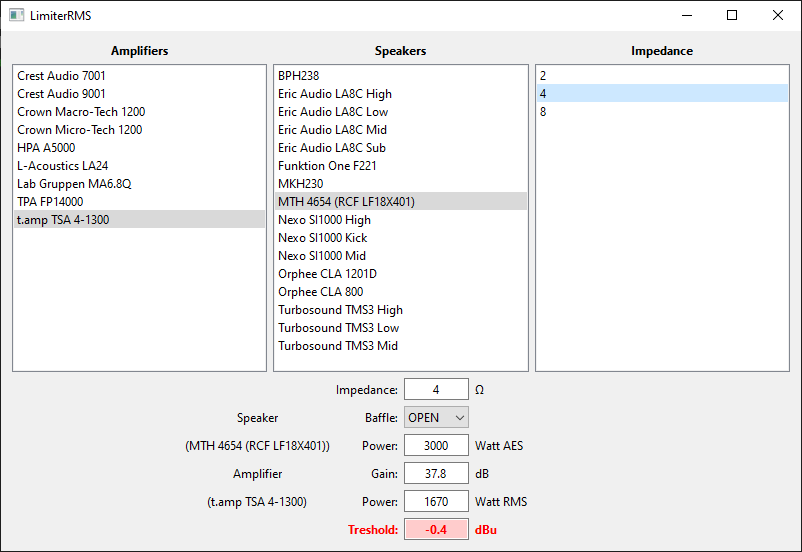

# LimiterRMS

Just a quick UI to compute RMS limiters on passive speakers.

## Installation

To run app, clone the repo and do the following:

```bash
$ cd ./LimiterRMS
$ python -m venv venvLimiter
$ ./venvLimiter/Scripts/activate
$ pip install -r requirements.txt
$ python ./limiterRMS.py
```



## Fix WAV files

In `scripts/` folder you can find a script that fixes WAV files from [Bandcamp](https://bandcamp.com/).

Simply edit path directly in script and run:

```bash
$ python ./scripts/fix_wav.py
```